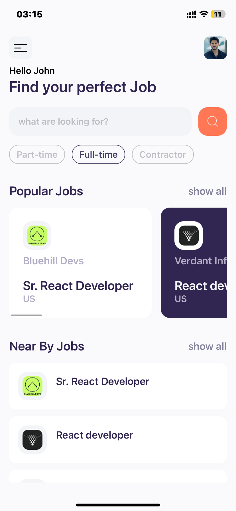

# Jobsearcher

A mobile application built with React Native & Rapid API that allows users to search for jobs, view popular jobs, find nearby jobs, and see detailed job information. The app is designed for job seekers to easily find and explore job opportunities based on various criteria.

## Features

- **Popular Jobs**: View a list of the most popular jobs in different categories.
- **Nearest Jobs**: Find jobs near the user's current location.
- **Job Details**: View detailed information about a job, including description, requirements, and how to apply.
- **Job Search**: Search for jobs by keyword as Job Type and using text queries.

## Screenshots
<div style="display: flex; justify-content: space-between;">



</div>

## Prerequisites

- **Node.js**: Make sure you have Node.js installed. You can download it from [nodejs.org](https://nodejs.org/).
- **Expo CLI**: Install Expo CLI globally using npm:
  
  ```bash
  
  npm install -g expo-cli
  ```

## Installation
 1. Clone the repository:

  ```bash
  git clone https://github.com/Dilum-IR/Jobsearcher.git
  cd Jobsearcher
  ```
2. Install dependencies:

  ```bash
  npm install
  ```
3. Run the app:

  ```bash
  expo start
  ```
4. Choose a device:

  Run on an iOS simulator, Android emulator, or your physical device using expo.


## Navigation

This app uses React Navigation for navigation between screens. To set up navigation:

- Install the necessary libraries:

  ```bash
  
  npm install @react-navigation/native @react-navigation/native-stack
  npm install react-native-screens react-native-safe-area-context
  ```

- Wrap your main App.js with NavigationContainer and define the stack navigator.

## API Integration

- The app integrates with a backend(Rapid API) to fetch job listings and search results.
- The API should support endpoints for fetching popular jobs, nearby jobs, and job search.
